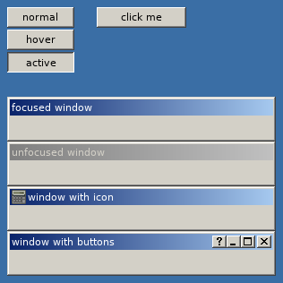

# WBUI

A simple [retained mode](https://en.wikipedia.org/wiki/Retained_mode) UI system written in pure Lua for the [LÖVE](https://love2d.org/) game engine.

## Completion
**This library is not quite ready for actual use yet, but I'd like it to be soon!**

- [x] Window
- [x] Button
- [x] Label
- [x] Dropdown list
- [x] Keyboard accessibility
- [ ] Easier element placement
- [x] Text input
- [ ] Spinner
- [ ] Checkbox
- [ ] Radio buttons
- [ ] Progress bar
- [ ] Slider
- [ ] Scrolling
- [ ] Context menu

## Usage
See `main.lua` for example usage. **Note that WBUI makes some assumptions about its path.** See `wbui.path` in the documentation for details.

## License
This library is licensed under the zlib license. For more information, see `LICENSE.txt`. **This software is offered with no warranty. If it ruins your project or burns your house down, it's not my problem.**

**The default theme is designed to resemble the Windows Classic theme.** Given how simple the theme is and the fact respected projects such as [Wine](https://i.imgur.com/PHNGyHO.png) and [ReactOS](https://reactos.org/sites/default/files/linter.png) comfortably reimplement the same theme and claim legality, I don't think this is a problem. If you disagree, consider making a fork or pull request to change it.

## Documentation
For something as simple as this, I'd recommend following the mantra of "The code *is* the documentation."
### Global
#### wbui.new(**string**: element class, **vararg**: parameters)
Creates a new element. Parameters dependent on class. Internally does `return wbui.classes[name]:new(...)`.
#### wbui.class(**string**: class name, optional **table**: element class)
Creates a new element class. It may optionally extend another class. This does not add it to `wbui.classes` for use with `wbui.new`, so it is necessary to add it manually.
#### wbui.initialize(optional **table**: configuration data)
Initializes WBUI.

Key | Value
--- | ---
`fonts` | Table of fonts
`colors` | Table of colors
`classes` | Array of classes to load

#### **string**: wbui.require
The prefix used for calls to `require`. Only needs to be overridden if you loaded WBUI with `dofile` or you changed `package.path` *after* loading WBUI.
#### **string**: wbui.path
The path of WBUI. If you require WBUI with `require("foo.bar")`, WBUI will assume it is located at `foo/bar`. If that is not the case, you need to manually override this *before* calling `wbui.initialize`.
### element
#### element:new(**vararg**: parameters)
Create, initialize, and return a new element. Called by `wbui.new`. Should not be called directly.
#### element:initialize(optional **number**: x, optional **number**: y)
Sets own X and Y coordinates relative to parent. Defaults to 0, 0.
#### element:append(**element**: child, optional **number**: index)
Add new child at specified index, or at the end if no index is specified.
#### element:remove()
Removes self from parent (if applicable). Does not actually destroy the object, so if you don't plan on respawning the window, you need to get rid of all references to it to avoid a memory leak.
#### element:getAbsolutePosition()
Returns the position of the element relative to the screen.
#### element:bringToFront()
Focuses the element and unfocuses all of its siblings.
#### element:onFocus()
Called when element is focused with `element:bringToFront`.
#### element:onFocusLost()
Called when element is unfocused due to a sibling being focused with `element:bringToFront`.
#### element:update(**number**: dt)
Calls itself on all of its children.
#### element:draw()
Calls itself on all of its children. Make sure to reset the graphics state to something sensible before using this or else weird things might happen. `love.graphics.translate` is used to make each child draw relative to its parent.
#### element:mouseDown(**number**: button, **number**: x, **number** y, **number** number of clicks in short time, **boolean**, is touch event)
Calls itself on any child where the cursor is within its bounding box.
#### element:mouseUp(**number**: button, **number**: x, **number**: y, **number** number of clicks in short time, **boolean**, is touch event)
Ditto.
#### element:mouseMoved(**number**: x, **number**: y, **number**: relative x, **number**: relative y, **boolean**: is touch event)
Calls itself on `wbui.mouseDown` or any child under the cursor. Also calls `element:mouseEnter` and `element:mouseLeave`.
#### element:mouseEnter(**number**: x, **number**: y, **number**: relative x, **number**: relative y, **boolean**: is touch event)
Does nothing. Called when the cursor starts hovering over the element.
#### element:mouseLeave(**number**: x, **number**: y, **number**: relative x, **number**: relative y, **boolean**: is touch event)
Does nothing. Called when the cursor stops hovering over the element.
#### element:keyDown(**string**: key, **string**: scancode, **boolean**: repeated)
Does nothing. Called when a key is pressed.
#### element:keyUp(**string**: key, **string**: scancode)
Does nothing. Called when a key is released.
#### element:textInput(**string**: text)
Does nothing. Called when text is entered. Requires `love.keyboard.setTextInput(true)`. UTF-8 encoding.
#### **number**: element.x
X position.
#### **number**: element.y
Y position.
#### optional **number**: element.w
Element width.
#### optional **number**: element.h
Element height.
#### optional **number**: element.ix
X offset for children.
#### optional **number**: element.iy
Y offset for children.
#### optional **number**: element.iw
Absolute width for children.
#### optional **number**: element.ih
Absolute height for children.
#### **boolean**: element.active
Whether the element is currently being interacted with.
#### **boolean**: element.focus
Whether the element is in focus.
#### **boolean**: celement.tabindex
Whether the element can be focused by pressing Tab.
### root
An element kept in `wbui.root` that contains all other elements. This is *not* a frame, and thus cannot be tabbed through. It's also not a class yet.
#### root:mouseUp(**number**: button, **number**: x, **number**: y)
Same as `element:mouseUp`, except it will also call itself once on `wbui.mouseDown`, if it exists.
#### root:mouseMoved(**number**: x, **number**: y, **number**: relative x, **number**: relative y, **boolean**: is touch event)
Same as `element:mouseMoved`, except it will also call itself once on `wbui.mouseDown`, if it exists.
### frame
A container for other elements that can be tabbed through.
#### frame:bringToFront()
Same as `element:bringToFront`, but it will also arrange itself to be last in its parent's list of children.
#### frame:initialize(**number**: x, **number**: y, **number**: width, **number**: height)
Creates a new frame with the corresponding dimensions.
### button
A button with text that can be clicked.
#### button:initialize(optional **string**: text, **number**: x, **number**: y, optional **number**: width, optional **number**: height)
Defaults to 75×23. If text is not specified, the button will be blank.
#### button:onClick()
Does nothing. Intended to be overridden by the user.
### imagebutton
Like a button, but with an image.
#### imagebutton:initialize(optional **Image**: image, **number**: x, **number**: y, optional **number**: width, optional **number**: height)
Defaults to 75×23. If image is a string, it will be loaded with `love.graphics.newImage`. If no image is specified, the button will be blank.
### window
A window with a title bar and (optional) title bar buttons that can be focused, unfocused, or dragged around.
#### window:initialize(optional **string**: title, **number**: x, **number**: y, **number**: width, **number**: height)
Creates a new window. If no title is specified, "Window" will be used. Each window will call `frame:bringToFront` on itself on initialization.
#### window:setMaximized(**boolean**: maximized)
Sets whether the window is maximized or not. When maximized, the window fills its entire parent and cannot be resized. When unmaximized, the window is restored to is original size.
#### window:close()
Removes the window and brings another window to the front.
#### window:onClose()
Does nothing. Return `true` to prevent the window from being closed.
#### window:toggleMaximized()
Calls `window:setMaximized` and updates the button icon.
#### window:minimize()
Does nothing.
#### window:help()
Does nothing.
#### window:showButton(**string**: name, **boolean**: add rather than remove)
Adds (or removes) the title bar button with the specified name and calls `window:updateButtonPositions`. If the name is something other than "close," "maximize," "minimize," or "help," extra work will be needed to make the button work properly. The button's icon and click handler will be determined by the `window.buttonIcons` and `window.buttonClickHandlers` tables. If the icon does not exist, the button will be blank. If the handler does not exist, the button will not have one. The button will be stored in `self[name..'btn']`.
#### window:updateButtonPositions()
Updates the position of the title bar buttons. Will ignore any button besides close, maximize, minimize, and help.
#### window:setIcon(optional **Image**: icon)
Sets (or removes) the icon for the window. If the icon is a string, it will be loaded with `love.graphics.newImage`. The icon *should* but does not *have* to be 16×16. If it's too large, it will be scaled down.
#### window:updateInnerDimensions()
Updates `self.ix`, `self.iy`, `self.iw`, and `self.ih` to correspond with the window's dimensions. Also calls `window:updateButtonPositions`.
#### window:generateTitleBar()
Generates the meshes used for the title bar gradient. You only need to call this manually if you update the title bar colors *after* creating the window.
### label
Displays text.
#### label:initialize(optional **string**: text, **number**: x, **number**: y, **number**: width, optional **number**: height)
If text is not specified, "Label" will be used. If height is not specified, it will be calculated with `label:calculateHeight`.
#### label:calculateHeight(optional **number**: width)
Returns the calculated height of the text. Uses current width if not specified.
### dropdown
A [dropdown menu](https://en.wikipedia.org/wiki/Drop-down_list). Supports the traditional method of clicking twice to select the option, also supports holding down, hovering over choice, and releasing. No keyboard support yet. Internally uses the undocumented `dropdown_list` class.
#### dropdown:initialize(**array**: options, **number**: x, **number**: y, optional **number**: width, optional **number**: height)
Options parameter mustn't be empty. Defaults to 229×23.
#### dropdown:select(**number**: index)
Selects the specified index from the options.
#### dropdown:onSelect(**number**: index, **string**: value)
Called when a value is selected.
### textbox
A box you can type into. **Does not yet support text selection or clipboard actions.**
#### textbox:initialize(optional **string**: text, **number**: x, **number**: y, optional **number**: width, optional **number**: height)
Default text is empty string. Defaults to 229×23.
#### textbox:onSubmit()
Does nothing. Called when user hits Return or Enter.
