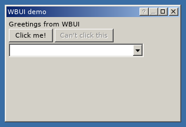

# WBUI

A simple [retained mode](https://en.wikipedia.org/wiki/Retained_mode) UI system written in pure Lua for the [LÖVE](https://love2d.org/) game engine. See `main.lua` for instructions on usage.

## License
This library is licensed under the zlib license. For more information, see `LICENSE.txt`. **This software is offered with no warranty. If it ruins your project or burns your house down, it's not my problem.**

**The default theme is designed to resemble the Windows Classic theme.** Given how simple the theme is and the fact respected projects such as [Wine](https://i.imgur.com/PHNGyHO.png) and [ReactOS](https://reactos.org/sites/default/files/linter.png) comfortably reimplement the same theme and claim legality, I don't think this is a problem. If you disagree, consider making a fork or pull request to change it.

## Documentation
### Global
#### wbui.new(**string**: element class, **vararg** parameters)
Creates a new element. Parameters dependent on class. Internally does `return wbui.classes[name]:new(...)`.
#### wbui.class(**string**: class name, optional **table**: element class)
Creates a new element class. It may optionally extend another class. This does not add it to `wbui.classes` for use with `wbui.new`, so it is necessary to add it manually.
#### wbui.initialize(optional **table**: configuration data)
Initializes WBUI.
##### Configuration options
Key | Value
--- | ---
`fonts` | Table of fonts
`colors` | Table of colors
`classes` | Array of classes to load
#### element:new(**vararg** parameters)
Create, initialize, and return a new element. Called by `wbui.new`. Should not be called directly.
#### element:initialize(optional **number** x, optional **number** y)
Sets own X and Y coordinates relative to parent. Defaults to 0, 0.
#### element:append(**element** child, optional **number** index)
Add new child at specified index, or at the end if no index is specified.
#### element:remove()
Removes self from parent (if applicable). Does not actually destroy the object, so if you don't plan on respawning the window, you need to get rid of all references to it to avoid a memory leak.
#### element:update(**number** dt)
Calls itself on all of its children.
#### element:draw()
Calls itself on all of its children. Make sure to reset the graphics state to something reasonable before using this or else weird things might happen. `love.graphics.translate` is used to make each child draw relative to its parent.
#### element:mouseDown(**number** button, **number** x, **number** y)
Calls itself on any child where the cursor is within its bounding box.
#### element:mouseUp(**number** button, **number** x, **number** y)
Ditto.
#### element:mouseMoved(**number** x, **number** y, **number** relative x, **number** relative y, **boolean** is touch event)
Does nothing.
#### wbui.root:mouseUp(**number** button, **number** x, **number** y)
Same as `element:mouseUp`, except it will also call itself once on `wbui.mouseDown`, if it exists.
#### wbui.root:mouseMoved(**number** x, **number** y, **number** relative x, **number** relative y, **boolean** is touch event)
Calls `element:mouseMoved` on `wbui.mouseDown`, if it exists.

